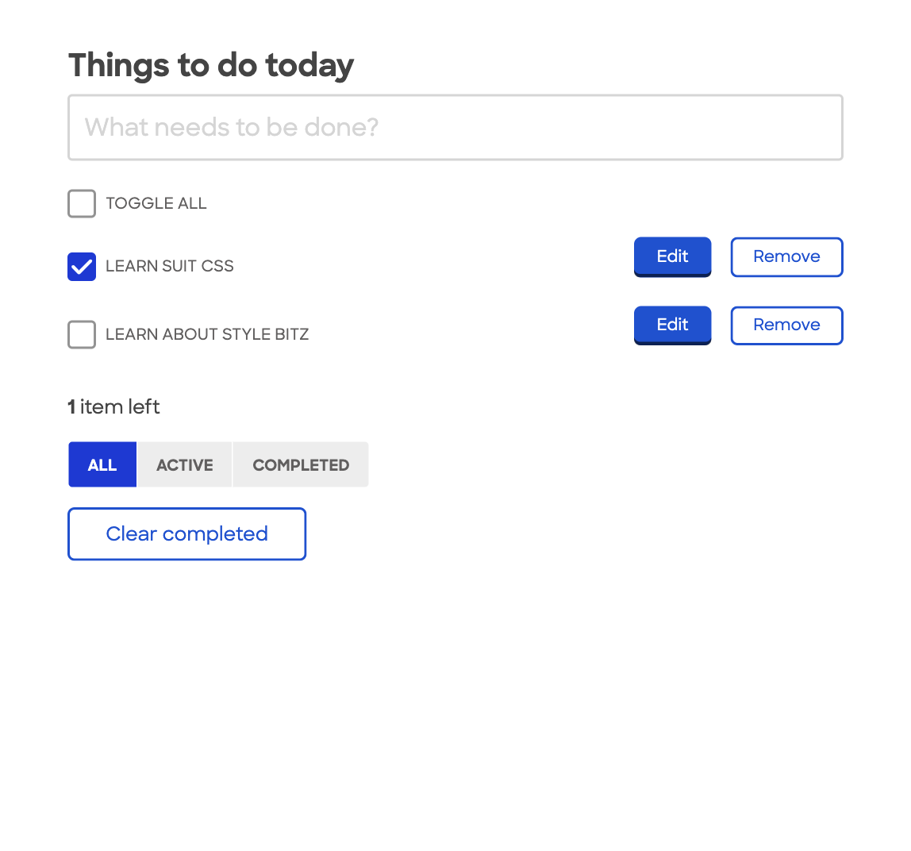
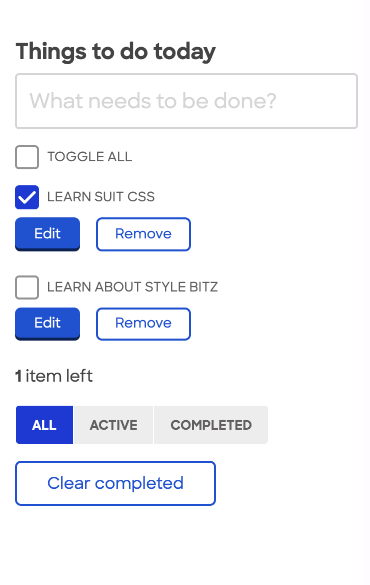

# Vue to Bitz

Let's add Style Bitz to a Vue app!

Today we'll be skinning a simple TodoMVC vue app to use style bitz for visual language and ux. Our output will look something like this:

**Desktop:**



**Mobile:**



The point of this exercise is not to present Style Bitz as a complete solution for JS apps, but rather to create some familiarity with what's there by experimenting with how its building blocks can contribute to a js app experience. There's definitely still work to be done to make it a friendly tool outside of a ruby and sprockets context, but hopefully it's work that we can all take on together and find value in.

## Project setup

- Make sure you have a reasonably recent version of node with yarn available. Adding strap is a #TODO, but for now I don't want to make assumptions around nodenv and homebrew.

```
yarn install
```

### Run the dev server

```
yarn serve
```

## Let's get building!

1. Open our app at localhost:8080. It's functional but not much to look at. We can pull in Style Bitz via inkpress cdn to get an HTML reset. Note that for production use we would want a versioned CDN to require the compiled css from.

- Open App.vue and `@import "https://www.customink.com/assets-inkpress/style_bitz/style_bitz-b584e440cf0182304bd48f5f6082a713b0733437.css";` in our style block.

---

2. Let's leverage our responsive breakpoints via the `sb-Wrapper` class.

- Open components/TodoList.vue and add `sb-Wrapper` to our outer section tag's classlist.

---

3. We can set up our page as a form and give our main input some default styles

- Add the class `sb-Form` to the outer section tag.
- Wrap `todo-Header`'s `input` tag with:

```html
<div class="sb-Form-group sb-Form-group--large">
  ...
</div>
```

---

4. Now we can remove the bullets from our todo list items via a utility class.

- Add the class `sb-Util-plainList` to our `<ul>` element

---

5. Let's style our checkboxes. Style Bitz gives us a CSS-only method to do this.

- Add the class `sb-Form-group` to each `.todo-Item-content` and `.todo-Item-buttons` element
- Add the class `sb-Form-checkbox to each checkbox's`label` element
- Add the element `<span class="sb-Form-indicator"></span>` before the text in each group

---

6. Now we should clean up the display of the list items. We want an inline form for each with edit and remove buttons, collapsing down to a stack of item and buttons on small breakpoints.

We should use flexbox to make sure our items resize gracefully and use up all of the available space.

- Add the class `sb-Form--inline--flex` to our `.todo-Item-view` div
- Style our `.todo-Item-buttons` class to `flex-grow: 0`. Add a second `.sb-Form-group` for specificity.
- Style our `.todo-Item-view` class to `align-items: center`.
- Style the buttons by adding classes respectively:
  - `sb-Btn sb-Btn--small`
  - `sb-Btn sb-Btn--small sb-Btn--secondary`
- Give some right margin to the first button with the class `sb-Btn--mr`
- Add some padding to the top and bottom of `content` and `buttons`, respectively to clean up the mobile view. We can use bourbon to do this!

---

7. Let's make the filter radio buttons into a tabbed radio button group. We don't want to use the jQuery code to handle selected state here so we can hook into the visibility prop being passed to the component.

- Wrap all the contents of the footer (except the link) with a `<div class="sb-Form-group sb-Form-group--horizontalRadioButonGroup">`
- Add a `:class` expression to each input element matching this logic for each respective filter value: `:class="{'is-Checked': this.visibility == 'all'}"`

---

8. How would we style the 'clear completed' link as a secondary button?
